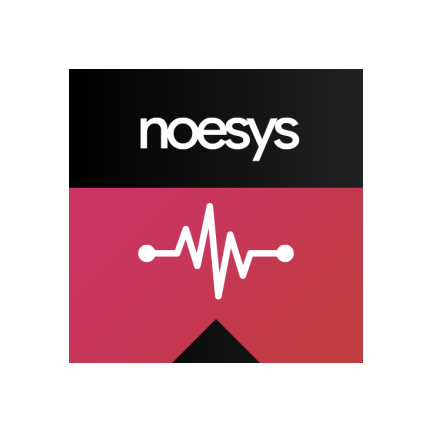

  

<!-- ABOUT THE PROJECT -->
## About

This project was born with the idea of providing a method of consulting the health systems and web servers from an application without having to depend on third party services and always in your pocket.

Your device becomes a small monitor that periodically checks and updates the status of the hosts you choose and notifies you in case any of them has resulted in an error.
You can also analyze the response performance of a specific host.

For simplicity, no services are used in the background, so the application needs to have the battery optimization turned off so that the application can continue to operate in the background and notifications of services can be received.

The application has been developed applying the principle of minimum privilege to request the least possible permissions, so the work of the crawler is linked to the main activity of the application.

## UI

I have tried at all times to maintain a careful, clean and minimalist interface, focusing on what is really important and trying to provide a proper user experience. The dark palette allows to take full advantage of the AMOLED screens.

Of course, it is subject to change to include new functionality as required, but always maintaining the aesthetics of purity and simplicity.

### Built With
* [Android Studio](https://developer.android.com/studio)
Not my preferred IDE but works well with Android projects
* [Flutter](https://flutter.dev/)
I am a fan :)

<!-- ROADMAP -->
## Roadmap

I have not tested the application thoroughly and because of them I am aware that multiple problems can appear, notifications that do not arrive, high battery consumption, errors, falls, false positives, etc..

The fact that the project is open source is the real way for us to solve all these problems together, feel free to open an Issue or do a PR.

See the [open issues](https://github.com/aeri/Noesys/issues) for a list of known issues (and proposed features).

<!-- LICENSE -->
## License

Distributed under the GENERAL PUBLIC LICENSE Version 3. See `COPYING` for more information.
