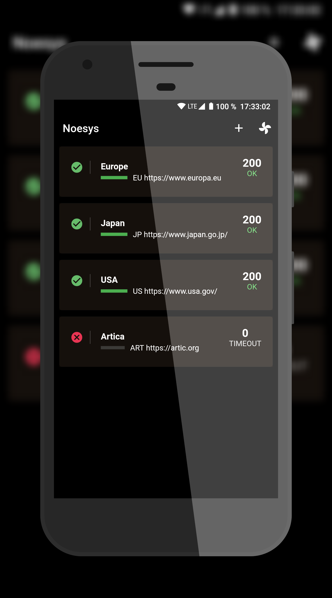

  

<!-- ABOUT THE PROJECT -->
## About

This project was born with the idea of providing a method of consulting the health systems and web servers from an application without having to depend on third party services and always in your pocket.

Your device becomes a small monitor that periodically checks and updates the status of the hosts you choose and notifies you in case any of them has resulted in an error.
You can also analyze the response performance of a specific host.

For simplicity, no services are used in the background, so the application needs to have the battery optimization turned off so that the application can continue to operate in the background and notifications of services can be received.

## Development

This application is a proof of concept developed with [Flutter](https://flutter.dev/), the support is only oriented to Android devices.

The UI is based on the [lineage2_servers_status](https://github.com/GabrielSantosRX/lineage2_servers_status) project.

<!-- LICENSE -->
## License

Distributed under the GENERAL PUBLIC LICENSE Version 3. See `COPYING` for more information.
